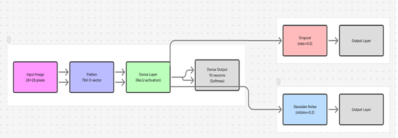
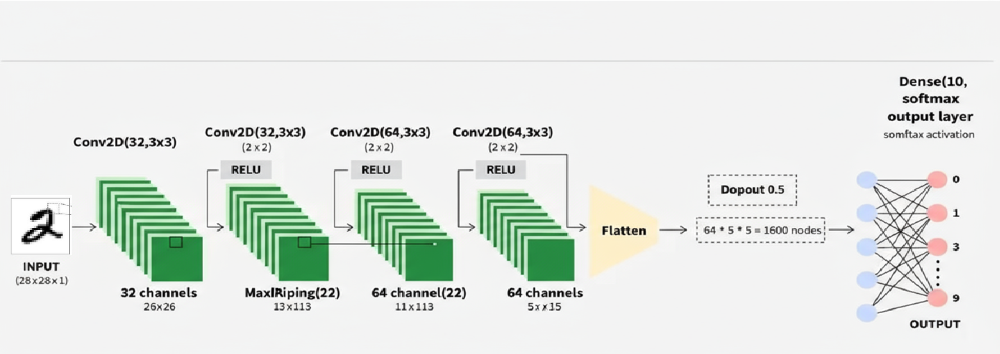
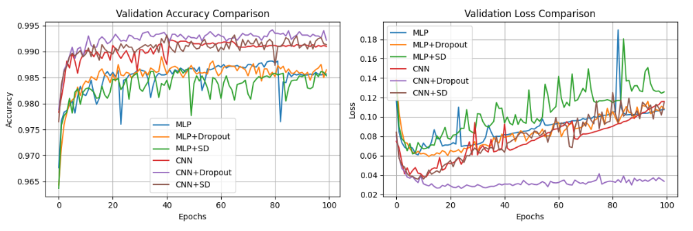
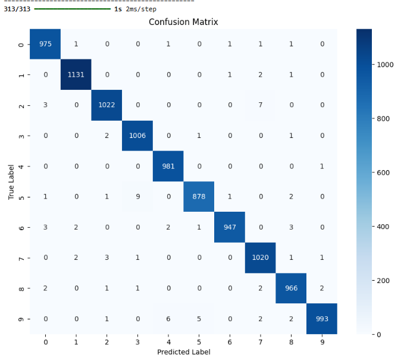
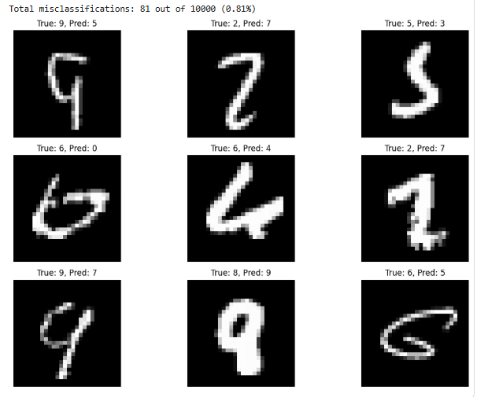

# Handwritten-Digit-Classification---MLP-vs.-CNN-with-Dropout-Gaussian-Noise-on-MNIST

MNIST Digit Classification – MLP vs. CNN (with Dropout & Gaussian Noise)
MNIST Handwritten Digits is a classic benchmark dataset of 70,000 grayscale images of handwritten digits (0-9) at 28×28 pixels[1]. In this solo project, I built and evaluated two types of neural network models – a Multi-Layer Perceptron (MLP) and a Convolutional Neural Network (CNN) – under three configurations each: baseline, with Dropout regularization, and with Gaussian noise injection. This side-by-side comparison highlights how model architecture and regularization technique affect performance on the same task.
Why This Project Is Unique: Unlike typical MNIST examples focusing on one model, this project directly compares an MLP and a CNN under identical conditions, with and without dropout or noise. This provides insight into how a model’s structure (flat vs. convolutional) and regularization (dropout vs. additive noise) influence learning and generalization.

Introduction and Goal
The goal is simple: achieve high accuracy in classifying MNIST digits, and observe how each model variant performs. An MLP treats the image as a flat vector of 784 features, while a CNN exploits the 2D structure of the image. MLPs ignore spatial patterns (each pixel is just an independent input), whereas CNNs capture local spatial features like strokes or edges[2]. As a result, CNNs are generally far more effective on image data[3]. By training both, we can quantify this difference. We also explore two regularization methods:
•	Dropout: Randomly dropping units during training forces the network to learn robust features and not rely on particular nodes[4]. Dropout is known to reduce overfitting by preventing co-adaptation of neurons[5].
•	Gaussian Noise Injection: Adding random noise (here, Gaussian with stddev 0.2) to layer inputs is another form of regularization[6]. The “SD” variant in this project refers to injecting Gaussian noise, which encourages the model to learn stable patterns despite perturbations[7]. This is analogous to dropout in its regularization effect.
By comparing MLP, MLP+Dropout, MLP+Noise against CNN, CNN+Dropout, CNN+Noise, this project reveals how much of the performance gain comes from architecture vs. from regularization.

Dataset Overview
The MNIST dataset contains 60,000 training images and 10,000 test images of handwritten digits 0 through 9[1]. Each image is 28×28 pixels (one channel). The classes are perfectly balanced (~6000 examples of each digit in the train set, ~1000 each in test), so accuracy is a suitable performance metric. No complex preprocessing is needed beyond scaling pixel values to [0,1].
Model Architectures
1. Multi-Layer Perceptron (MLP): The MLP is a simple feed-forward network. In this project, it consists of a flatten layer (28×28 → 784) feeding into at least one dense hidden layer with ReLU activation, and an output layer of 10 neurons with softmax. The exact hidden layer size was tuned to get a similar order of magnitude of parameters as the CNN (~ tens of thousands of weights).
•	MLP Baseline: Dense layers only (no regularization). This serves as a control.
•	MLP + Dropout: A dropout layer (rate 0.5) is inserted (after the hidden layer) during training, dropping half the units randomly each update to prevent overfitting.
•	MLP + Gaussian Noise: A GaussianNoise layer (stddev=0.2) is added (after the hidden layer) during training. This injects random noise to the activations, forcing the network to learn noise-robust features.
  
*Multi-layer Perceptron architecture*
 
2. Convolutional Neural Network (CNN): The CNN architecture is inspired by LeNet-5 style networks. It uses convolutional layers to exploit image spatial structure[2]. In this project, the CNN has two convolutional layers (with ReLU) each followed by a max-pooling layer, then a flatten and dense output. The conv layers learn local patterns (like strokes) and pooling provides spatial invariance.
•	CNN Baseline: Two conv layers (e.g. 32 filters and 64 filters of size 3×3) + pooling, then a dense output layer (10 classes).
•	CNN + Dropout: A dropout layer (rate 0.5) is added after flattening (i.e. before the final dense layer). This drops half the features before the output layer during training.
•	CNN + Gaussian Noise: A GaussianNoise layer (stddev=0.2) is added after flattening (instead of dropout) to perturb the feature vector before the output layer.
   
*Convolutional Network + Gaussian Noise architecture*
 
Illustration of the CNN architecture used (Conv → Conv → Flatten → Dense). Dropout (0.5) or Gaussian noise could be applied to the flattened 1600-dimensional feature vector before the final output. The MLP (not shown) uses a single dense hidden layer instead of conv layers.
Each model is compiled with Adam optimizer and categorical cross-entropy loss (appropriate for multi-class classification). We track accuracy as the primary metric.
Setup and Installation
To run this project locally:
1.	Clone the repository (or download the code):
 	git clone https://github.com/your-username/mnist-mlp-cnn-comparison.git
cd mnist-mlp-cnn-comparison
2.	Install dependencies: Ensure you have Python 3.x and install required libraries. You can use pip with the provided requirements file:
 	pip install -r requirements.txt
 	Requirements include: tensorflow (for Keras), numpy, matplotlib, seaborn, and scikit-learn. (Alternatively, install manually: pip install tensorflow numpy matplotlib seaborn scikit-learn.)
3.	Run the Jupyter Notebook: Launch the notebook to interactively execute training and see results:
 	jupyter notebook MNIST_MLP_vs_CNN.ipynb
 	Open the notebook in your browser and run the cells to train models and reproduce plots. The notebook contains all code for building models, training, and evaluation.
4.	(Optional) Run via script: If you prefer, a script version of the experiment is provided. For example:
 	python compare_models.py
 	This will train all six model variants in sequence and output the results/plots to the plots/ directory.
Training & Evaluation Procedure
All models were trained on the same training data and evaluated on the same test set for a fair comparison. Key details:
•	Training regimen: 100 epochs for each model, using a batch size of 128. We reserved 10% of the training set as a validation split to monitor performance during training (so effectively 54,000 train, 6,000 validation). No early stopping was used; all models trained for the full 100 epochs for consistency.
•	Normalization: Input pixel values are normalized to the range [0,1]. No other data augmentation or preprocessing was applied.
•	Hardware: The models are small enough to train on CPU in a reasonable time (each model ~15-30 minutes per epoch on CPU). Using a GPU significantly speeds up training to ~1-3 minutes.
•	Metrics: We track training and validation accuracy/loss per epoch. After training, we evaluate on the 10,000-image test set to get final accuracy, and we compute a confusion matrix and classification report.
Each network starts from random initial weights. To ensure a fair comparison, all were run with the same number of epochs and similar optimization settings. Dropout and noise were only active during training (disabled for evaluation). After training, we saved the model weights for each variant and collected performance metrics.

Results and Discussion
Validation Performance Comparison
After training the models, we compared their validation accuracy and loss curves:
Validation accuracy (left) and loss (right) over epochs for each model variant. Curves shown for MLP (blue), MLP+Dropout (orange), MLP+Noise (green), CNN (red), CNN+Dropout (purple), CNN+Noise (brown).
Several observations can be made from these curves:
•	CNNs outperform MLPs: The CNN-based models consistently achieve higher validation accuracy than MLP variants[8]. By the end of training, the plain CNN reaches about ~99% val accuracy, whereas the plain MLP plateaus around ~98%. The CNN’s ability to leverage spatial features gives it an edge[3]. In one similar experiment, a CNN with ~26k parameters achieved 98.2% accuracy vs. ~96% for a 25k-param MLP[9] – our results mirror this trend.

•	Regularization helps generalization: Both dropout and Gaussian noise improved performance or stability. The MLP+Dropout and MLP+Noise variants ended up with slightly higher accuracy than the vanilla MLP, indicating less overfitting. Likewise, CNN+Dropout and CNN+Noise both matched or exceeded the baseline CNN’s accuracy. Regularization provides a small but noticeable boost in generalization by reducing overfit tendencies[10][11].
•	Stability of training: The models with noise or dropout showed smoother training curves (less volatility in the accuracy from epoch to epoch), especially the CNN+Noise model. The added noise acts like a form of data augmentation each epoch, resulting in more stable convergence[11]. All models tended to converge by around epoch 30-50, after which gains were minimal.
•	Dropout vs. Noise: The outcomes of using dropout versus Gaussian noise were broadly similar in this experiment. Neither regularization dramatically improved final accuracy over the other. However, we did notice that the GaussianNoise variant on CNN achieved the highest peak accuracy (around 99.2% val accuracy) by a small margin. Gaussian noise provides continuous perturbation (rather than dropout’s binary mask), which might have helped the CNN squeeze out a bit more performance. Both techniques, however, were beneficial and their curves closely tracked each other for both MLP and CNN cases.
   
*Comparison of accuracy and loss of the models*
In summary, the CNN + GaussianNoise model emerged as the top performer on validation data, closely followed by CNN + Dropout, then the baseline CNN. All CNN variants outperformed the MLP variants. The regularized MLPs did better than the plain MLP, but still fell short of CNNs. This confirms that architecture plays a larger role than these regularization methods for this task – CNN’s built-in advantages trump the MLP’s best regularized efforts. Regularization did narrow the gap slightly for the MLP (and helped the CNN hit the 99%+ range reliably).
  
*Model description*
   
*Final Convolutional Network + Gaussian Noise architecture*
Test Set Performance and Confusion Matrix
After selecting the final models, we evaluated on the 10,000-image test set. The best model (CNN with Gaussian noise) achieved 99.2% accuracy on test data, misclassifying only 81 out of 10,000 digits[12]. For context, this is on par with many standard CNN results on MNIST. The baseline CNN was only slightly behind (~98.9-99.1% range), and the MLP models achieved in the high 98% range.
Below is the confusion matrix for the CNN+Noise model’s predictions on the test set:
 
    
*CONFUSION MATRIX ANALYSIS*
Confusion matrix for the best model (CNN + GaussianNoise) on 10,000 test images. Rows are true labels 0–9, columns are predicted labels. Most confusion is very minimal (off-diagonal counts are near zero).
As shown above, the model performs extremely well across all digit classes. The diagonal entries dominate (e.g. 975/1000 “0” images correctly classified as 0, 1131/1135 “1” images classified as 1, etc.), and off-diagonal errors are rare. No single digit suffered significantly more misclassifications than others – errors are distributed fairly evenly. This is expected given the dataset is balanced and the model has near-perfect overall accuracy. A few observations:
•	The worst confusion in this run was the model mistaking some 5’s as 3’s or 8’s (see row for true 5: a few cases predicted 3 or 8) and some 9’s as 4’s. These mistakes are understandable since those digits can look similar if written unclearly.
•	Per-class precision and recall are all ~0.98-1.00. For example, in the classification report, class “1” had precision 1.00 and recall 1.00 (no mistakes on 1’s), class “8” had precision 0.99, recall 0.98, etc. The overall test accuracy was 99.19%, with a macro-average F1 score of 0.99. In other words, the model generalized almost perfectly on MNIST.
Note: Achieving >99% on MNIST is relatively easy for modern CNNs[13][14]. The intent here was not to beat SOTA but to compare models. As expected, even a simple CNN outperforms a fully-connected MLP on image data by a significant margin[8]. Regularization (dropout/noise) further boosts generalization slightly, but cannot compensate for the absence of convolutional layers in the MLP.
Example Misclassified Digits
To get a better sense of what mistakes the model made, we can visualize some of the misclassified examples. Below are a few test images the top model got wrong, along with their true and predicted labels:
     
   *Misclassified Digits*
Examples of misclassified digits by the CNN model. Each sub-image shows the input digit with its true label and the model’s prediction. These typically include unusual or ambiguous handwriting (e.g., a poorly written "9" mistaken for a "5").
Even among the errors, one can see why the model struggled: some digits are written in atypical ways (for instance, the first image above is a 9 that the model predicted as 5 – it has an open top loop like a 5). Another example is a 2 that was predicted as 7 (second image, top row) – the curve on the bottom of the 2 is very light, making it look like a 7. Such cases reflect limitations of the dataset (some writing styles are confusing) rather than a fundamental flaw in the model. With data augmentation or ensembling, some of these errors could potentially be eliminated, but for a single model training, 99%+ accuracy is near the ceiling on MNIST.
How to Use the Code
•	Jupyter Notebook: The provided notebook contains all steps from data loading to model training and evaluation. You can run each section to reproduce the results. Feel free to adjust parameters (e.g. try a different noise level or dropout rate) and re-run to see how it affects performance.
•	Switching Models: In the notebook, training loops for each model variant are clearly labeled. You can comment out models you don’t want to run. By default, it trains all six variants in sequence and stores their training history for plotting.
•	Saving and Loading Models: The notebook demonstrates how to save a trained model (model.save('model_name.h5')) and later load it for inference. This can be useful if you want to avoid re-training every time.
•	Inference on New Data: You can use any of the trained models to predict on new digit images. For example, after loading a model, call model.predict(new_images) to get probabilities for each class.
Conclusion
In this project, I individually implemented and analyzed multiple neural networks on a simple image classification task. The CNN architecture substantially outperformed the MLP, confirming that convolutions are far better at image feature extraction[3]. Regularization techniques – Dropout and Gaussian noise injection – were effective in bolstering each model’s generalization: they reduced overfitting and made training more stable, ultimately yielding a few extra percentage points in accuracy in some cases. Notably, the CNN with Gaussian noise achieved the highest accuracy (~99.2%), underlining that adding noise can be as helpful as dropout in practice[7].
This project demonstrates the importance of choosing the right model architecture for the data domain: an MLP, even with noise or dropout, cannot fully bridge the gap to a CNN on image data. For tasks involving spatial data like images, convolutional networks are indispensable[2]. On the other hand, for non-image data or smaller datasets, MLPs with proper regularization might suffice.
Finally, as a solo project, this endeavor helped me solidify my understanding of deep learning workflows – from data preprocessing and model construction to training, tuning, and evaluation. The code and results here can serve as a reference for anyone interested in how different network types and regularization methods perform on a benchmark problem. Feel free to explore the repository, run the notebook, and build upon this comparison for your own learning or projects!

References: The methodology and results discussed are consistent with known findings in literature, for example: CNNs leveraging spatial hierarchies to outperform MLPs on image recognition[3], and the effectiveness of dropout[4] or noise injection[6] in reducing overfitting. For more on these topics, you may refer to the original dropout paper by Srivastava et al. (2014)[15] and other deep learning resources.
________________________________________
[1] [2] [3] [8] [9] Daniel Gustaw - From MLP to CNN. Neural Networks for MNIST Digit Recognition
https://gustawdaniel.com/posts/en/mlp-cnn-mnist/
[4] [10] [11] [12] Convent_to_classify_MNIST_digits_MLP&CNN&Dropout&Noise.ipynb
file://file-HEVMkxHp5dfHiYKahoe496
[5] [6] [7] Noise injection for training artificial neural networks - GeeksforGeeks
https://www.geeksforgeeks.org/deep-learning/noise-injection-for-training-artificial-neural-networks/
[13] [14] [15] jmlr.org
http://www.jmlr.org/papers/volume15/srivastava14a/srivastava14a.pdf?utm_content=buffer79b4
